# 🚀 Crypt-Payment Production Deployment Guide

## 📋 Table of Contents
1. [Overview](#overview)
2. [Architecture](#architecture)
3. [Pre-Deployment Checklist](#pre-deployment-checklist)
4. [Part 1: Blockchain Network Deployment](#part-1-blockchain-network-deployment)
5. [Part 2: Backend API Deployment](#part-2-backend-api-deployment)
6. [Part 3: Frontend Mobile App Deployment](#part-3-frontend-mobile-app-deployment)
7. [Verification & Testing](#verification--testing)
8. [Troubleshooting](#troubleshooting)

---

## Overview

**Crypt-Payment** is a full-stack cryptocurrency payment application consisting of:

- **Smart Contracts (Hardhat)**: ERC-20 token (`MyToken`) and Vault system (`TokenVault`)
- **Backend (FastAPI)**: RESTful API with blockchain integration and SQLite database
- **Frontend (Expo React Native)**: Cross-platform mobile application

**Current Development Setup:**
- Hardhat: Local network on `http://127.0.0.1:8545`
- Backend: `http://0.0.0.0:8000`
- Frontend: Expo development server

---

## Architecture

```mermaid
graph TB
    A[Mobile App<br/>Expo React Native] -->|HTTP REST API| B[Backend Server<br/>FastAPI]
    B -->|Web3.py| C[Blockchain Network<br/>Ethereum Compatible]
    C -->|Smart Contracts| D[MyToken Contract<br/>ERC-20]
    C -->|Smart Contracts| E[TokenVault Contract<br/>Shared Vault]
    B -->|SQLite| F[Database<br/>Users & Transactions]
    
    style A fill:#61DAFB
    style B fill:#009688
    style C fill:#627EEA
    style D fill:#F7931A
    style E fill:#F7931A
    style F fill:#003B57
```



**Data Flow:**
1. User interacts with **Mobile App** (Register, Login, Send Payment)
2. App sends authenticated requests to **FastAPI Backend**
3. Backend validates user, then interacts with **Blockchain Network** via Web3
4. Smart contracts execute on blockchain, backend records transaction in **SQLite DB**
5. Response flows back to user with transaction confirmation

---

## Pre-Deployment Checklist

### Required Accounts & Services
- [ ] Server with Linux (Ubuntu 20.04+ recommended) or cloud VPS
- [ ] Domain name (optional but recommended)
- [ ] SSL certificate (Let's Encrypt recommended)
- [ ] Blockchain RPC endpoint (choose one):
  - Ethereum Mainnet: Infura, Alchemy, QuickNode
  - Polygon: Polygon RPC
  - BNB Smart Chain: Public RPC nodes
  - Or run your own Ethereum node (Geth/OpenEthereum)

### Local Files to Review
- [`/Users/shreeharan2006/sh/Hype/backk/Crypt-Payment/contracts/MyToken.sol`](file:///Users/shreeharan2006/sh/Hype/backk/Crypt-Payment/contracts/MyToken.sol)
- [`/Users/shreeharan2006/sh/Hype/backk/Crypt-Payment/contracts/TokenVault.sol`](file:///Users/shreeharan2006/sh/Hype/backk/Crypt-Payment/contracts/TokenVault.sol)
- [`/Users/shreeharan2006/sh/Hype/backk/Crypt-Payment/scripts/deploy.js`](file:///Users/shreeharan2006/sh/Hype/backk/Crypt-Payment/scripts/deploy.js)
- [`/Users/shreeharan2006/sh/Hype/backk/Crypt-Payment/backend/app/main.py`](file:///Users/shreeharan2006/sh/Hype/backk/Crypt-Payment/backend/app/main.py)
- [`/Users/shreeharan2006/sh/Hype/backk/Crypt-Payment/frontend/app.json`](file:///Users/shreeharan2006/sh/Hype/backk/Crypt-Payment/frontend/app.json)

---

## Part 1: Blockchain Network Deployment

> [!WARNING]
> **Production blockchain deployment involves REAL money and gas fees**. Always test on testnets (Goerli, Sepolia) before mainnet deployment.

### Option A: Deploy to Public Testnet (Recommended for Testing)

#### Step 1.1: Choose a Testnet
- **Sepolia** (Ethereum testnet) - Recommended
- **Mumbai** (Polygon testnet)
- **BSC Testnet**

#### Step 1.2: Get Testnet ETH
1. Visit a faucet:
   - Sepolia: https://sepoliafaucet.com/
   - Mumbai: https://faucet.polygon.technology/
2. Request testnet tokens using your deployer wallet address

#### Step 1.3: Update Hardhat Configuration
Edit [`hardhat.config.js`](file:///Users/shreeharan2006/sh/Hype/backk/Crypt-Payment/hardhat.config.js):

```javascript
require("@nomiclabs/hardhat-ethers");
require('dotenv').config();

module.exports = {
  solidity: "0.8.20",
  networks: {
    localhost: {
      url: "http://127.0.0.1:8545"
    },
    sepolia: {
      url: process.env.SEPOLIA_RPC_URL || "https://sepolia.infura.io/v3/YOUR_INFURA_KEY",
      accounts: [process.env.DEPLOYER_PRIVATE_KEY],
      chainId: 11155111
    },
    polygon_mumbai: {
      url: process.env.MUMBAI_RPC_URL || "https://rpc-mumbai.maticvigil.com",
      accounts: [process.env.DEPLOYER_PRIVATE_KEY],
      chainId: 80001
    }
  }
};
```

#### Step 1.4: Create Environment File for Deployment
Create `/Users/shreeharan2006/sh/Hype/backk/Crypt-Payment/.env.deployment`:

```bash
# RPC URLs
SEPOLIA_RPC_URL=https://sepolia.infura.io/v3/YOUR_INFURA_PROJECT_ID
MUMBAI_RPC_URL=https://rpc-mumbai.maticvigil.com

# Deployer private key (DO NOT COMMIT THIS)
DEPLOYER_PRIVATE_KEY=0xYOUR_PRIVATE_KEY_HERE

# Gas settings (optional)
GAS_PRICE=20000000000
GAS_LIMIT=5000000
```

> [!CAUTION]
> **NEVER commit `.env.deployment` to Git**. Add it to `.gitignore` immediately.

#### Step 1.5: Deploy Contracts to Testnet
From project root (`/Users/shreeharan2006/sh/Hype/backk/Crypt-Payment`):

```bash
# Install dependencies if not already done
npm install

# Compile contracts
npx hardhat compile

# Deploy to Sepolia testnet
npx hardhat run scripts/deploy.js --network sepolia

# Or deploy to Mumbai
npx hardhat run scripts/deploy.js --network polygon_mumbai
```

**Expected Output:**
```
Deploying contracts with: 0xYourDeployerAddress
Token deployed at: 0xTokenContractAddress
Vault deployed at: 0xVaultContractAddress
Artifacts available under artifacts/contracts/
```

> [!IMPORTANT]
> **Save these contract addresses!** You'll need them for backend configuration.

#### Step 1.6: Verify Contracts on Etherscan (Optional)
Install hardhat-etherscan plugin and verify:

```bash
npm install --save-dev @nomiclabs/hardhat-etherscan

# Add to hardhat.config.js
etherscan: {
  apiKey: process.env.ETHERSCAN_API_KEY
}

# Verify MyToken
npx hardhat verify --network sepolia 0xTokenAddress "MockUSDC" "mUSDC" 1000000

# Verify TokenVault
npx hardhat verify --network sepolia 0xVaultAddress 0xTokenAddress
```

---

### Option B: Deploy to Mainnet (Production)

> [!CAUTION]
> **Mainnet deployment costs real ETH for gas fees**. Ensure you have sufficient funds and have thoroughly tested on testnet.

Follow the same steps as Option A, but use `mainnet` network configuration:

```javascript
mainnet: {
  url: process.env.MAINNET_RPC_URL || "https://mainnet.infura.io/v3/YOUR_INFURA_KEY",
  accounts: [process.env.DEPLOYER_PRIVATE_KEY],
  chainId: 1,
  gasPrice: 20000000000 // Adjust based on gas prices
}
```

Deploy:
```bash
npx hardhat run scripts/deploy.js --network mainnet
```

---

### Option C: Private Blockchain Node (Advanced)

If running your own Ethereum node:

#### Step 1: Set up Geth or OpenEthereum
```bash
# Example with Geth
geth --http --http.addr "0.0.0.0" --http.port 8545 \
     --http.api "eth,net,web3,personal" \
     --syncmode "fast" \
     --cache 4096
```

#### Step 2: Wait for sync and deploy
```bash
# Deploy to your private node
npx hardhat run scripts/deploy.js --network localhost
```

---

## Part 2: Backend API Deployment

### Step 2.1: Prepare Server Environment

SSH into your server:
```bash
ssh user@your-server-ip
```

#### Install Dependencies
```bash
# Update system
sudo apt update && sudo apt upgrade -y

# Install Python 3.10+
sudo apt install python3.10 python3.10-venv python3-pip -y

# Install Nginx (reverse proxy)
sudo apt install nginx -y

# Install Supervisor (process manager)
sudo apt install supervisor -y

# Install Certbot (SSL certificates)
sudo apt install certbot python3-certbot-nginx -y
```

### Step 2.2: Upload Backend Code

From your local machine:
```bash
# Create deployment package (exclude unnecessary files)
cd /Users/shreeharan2006/sh/Hype/backk/Crypt-Payment
tar -czf backend-deploy.tar.gz backend/ --exclude=backend/env --exclude=backend/__pycache__ --exclude=backend/*.db

# Upload to server
scp backend-deploy.tar.gz user@your-server-ip:/home/user/

# SSH to server and extract
ssh user@your-server-ip
cd /home/user
tar -xzf backend-deploy.tar.gz
cd backend
```

### Step 2.3: Configure Production Environment

Create `/home/user/backend/.env.production`:

```bash
# Blockchain Configuration
RPC_URL=https://sepolia.infura.io/v3/YOUR_INFURA_KEY  # Or your chosen network
PRIVATE_KEY=0xYOUR_ADMIN_PRIVATE_KEY  # Admin wallet for signing transactions
PUBLIC_ADDRESS=0xYOUR_ADMIN_PUBLIC_ADDRESS

# Contract Addresses (from Part 1 deployment)
TOKEN_ADDRESS=0xYOUR_DEPLOYED_TOKEN_ADDRESS
VAULT_ADDRESS=0xYOUR_DEPLOYED_VAULT_ADDRESS

# Artifact Paths (update to server paths)
TOKEN_ARTIFACT_PATH=/home/user/backend/app/abi/MyToken.json
VAULT_ARTIFACT_PATH=/home/user/backend/app/abi/TokenVault.json

# Database (SQLite for simplicity, use PostgreSQL for production)
DATABASE_URL=sqlite:///./vaultpay.db

# JWT Secret (generate a strong random secret)
SECRET_KEY=your-super-secret-jwt-key-change-this-in-production
ALGORITHM=HS256
ACCESS_TOKEN_EXPIRE_MINUTES=30

# CORS Origins (your frontend URLs)
CORS_ORIGINS=["https://your-app-domain.com"]

# Server Configuration
HOST=0.0.0.0
PORT=8000
WORKERS=4
```

> [!TIP]
> Generate a secure `SECRET_KEY` using: `openssl rand -hex 32`

### Step 2.4: Copy Contract ABIs

The backend needs contract ABIs to interact with blockchain. Copy ABI files:

```bash
# On server
mkdir -p /home/user/backend/app/abi

# From local machine, upload ABIs
scp /Users/shreeharan2006/sh/Hype/backk/Crypt-Payment/artifacts/contracts/MyToken.sol/MyToken.json user@your-server-ip:/home/user/backend/app/abi/
scp /Users/shreeharan2006/sh/Hype/backk/Crypt-Payment/artifacts/contracts/TokenVault.sol/TokenVault.json user@your-server-ip:/home/user/backend/app/abi/
```

Or if already on server:
```bash
# Extract only the ABI from full artifact
cd /home/user/backend/app/abi
# Manually create MyToken.json with ABI from your deployed contract
```

### Step 2.5: Set Up Python Virtual Environment

```bash
cd /home/user/backend
python3 -m venv env
source env/bin/activate

# Install dependencies from requirements.txt
pip install --upgrade pip
pip install -r requirements.txt

# Additional production dependencies
pip install gunicorn  # Production WSGI server
```

**Current [`requirements.txt`](file:///Users/shreeharan2006/sh/Hype/backk/Crypt-Payment/backend/requirements.txt):**
```
fastapi
uvicorn
web3
python-dotenv
sqlalchemy
python-jose[cryptography]
bcrypt
python-multipart
```

### Step 2.6: Update Backend Code for Production

Edit [`/home/user/backend/app/main.py`](file:///Users/shreeharan2006/sh/Hype/backk/Crypt-Payment/backend/app/main.py):

Update CORS configuration:
```python
# Change from allow_origins=["*"] to:
app.add_middleware(
    CORSMiddleware,
    allow_origins=os.getenv("CORS_ORIGINS", "").split(","),  # Read from .env
    allow_credentials=True,
    allow_methods=["*"],
    allow_headers=["*"],
)
```

Update hardcoded contract addresses to use environment variables:
```python
# In backend/app/services/blockchain.py or main.py
import os
from dotenv import load_dotenv

load_dotenv(".env.production")

TOKEN_ADDRESS = os.getenv("TOKEN_ADDRESS")
VAULT_ADDRESS = os.getenv("VAULT_ADDRESS")
```

### Step 2.7: Set Up Gunicorn Service

Create `/home/user/backend/gunicorn_config.py`:

```python
import multiprocessing
import os

bind = "0.0.0.0:8000"
workers = int(os.getenv("WORKERS", multiprocessing.cpu_count() * 2 + 1))
worker_class = "uvicorn.workers.UvicornWorker"
keepalive = 120
timeout = 120
accesslog = "/home/user/backend/logs/access.log"
errorlog = "/home/user/backend/logs/error.log"
loglevel = "info"
```

Create log directory:
```bash
mkdir -p /home/user/backend/logs
```

### Step 2.8: Configure Supervisor (Process Management)

Create `/etc/supervisor/conf.d/crypt-payment-backend.conf`:

```ini
[program:crypt-payment-backend]
directory=/home/user/backend
command=/home/user/backend/env/bin/gunicorn app.main:app -c gunicorn_config.py
user=user
autostart=true
autorestart=true
stopasgroup=true
killasgroup=true
stderr_logfile=/home/user/backend/logs/supervisor.err.log
stdout_logfile=/home/user/backend/logs/supervisor.out.log
environment=PATH="/home/user/backend/env/bin",DOTENV_PATH="/home/user/backend/.env.production"
```

Start the service:
```bash
sudo supervisorctl reread
sudo supervisorctl update
sudo supervisorctl start crypt-payment-backend
sudo supervisorctl status
```

### Step 2.9: Configure Nginx Reverse Proxy

Create `/etc/nginx/sites-available/crypt-payment`:

```nginx
server {
    listen 80;
    server_name api.your-domain.com;  # Replace with your domain

    location / {
        proxy_pass http://127.0.0.1:8000;
        proxy_set_header Host $host;
        proxy_set_header X-Real-IP $remote_addr;
        proxy_set_header X-Forwarded-For $proxy_add_x_forwarded_for;
        proxy_set_header X-Forwarded-Proto $scheme;
        
        # WebSocket support (if needed)
        proxy_http_version 1.1;
        proxy_set_header Upgrade $http_upgrade;
        proxy_set_header Connection "upgrade";
        
        # Timeouts
        proxy_connect_timeout 60s;
        proxy_send_timeout 60s;
        proxy_read_timeout 60s;
    }
    
    # Health check endpoint
    location /health {
        access_log off;
        return 200 "healthy\n";
        add_header Content-Type text/plain;
    }
}
```

Enable the site:
```bash
sudo ln -s /etc/nginx/sites-available/crypt-payment /etc/nginx/sites-enabled/
sudo nginx -t  # Test configuration
sudo systemctl reload nginx
```

### Step 2.10: Set Up SSL Certificate

```bash
sudo certbot --nginx -d api.your-domain.com
```

Follow prompts. Certbot will automatically update Nginx config for HTTPS.

### Step 2.11: Verify Backend is Running

```bash
# Check supervisor status
sudo supervisorctl status crypt-payment-backend

# Test local endpoint
curl http://localhost:8000/health

# Test public endpoint
curl https://api.your-domain.com/health
```

**Expected Response:**
```json
{"status": "healthy"} // Or similar
```

---

## Part 3: Frontend Mobile App Deployment

### Deployment Options

The Expo React Native app can be deployed in multiple ways:

1. **Expo Go** (Development/Testing only)
2. **Expo Application Services (EAS)** (Recommended for production)
3. **Standalone APK/IPA** (Manual build)

---

### Option A: Expo Application Services (EAS) - Recommended

#### Step 3.1: Install EAS CLI

On your local machine:
```bash
cd /Users/shreeharan2006/sh/Hype/backk/Crypt-Payment/frontend
npm install -g eas-cli

# Login to Expo account
eas login
```

#### Step 3.2: Configure App for Production

Edit [`app.json`](file:///Users/shreeharan2006/sh/Hype/backk/Crypt-Payment/frontend/app.json):

```json
{
  "expo": {
    "name": "Crypt Payment",
    "slug": "crypt-payment",
    "version": "1.0.0",
    "orientation": "portrait",
    "icon": "./assets/icon.png",
    "userInterfaceStyle": "light",
    "splash": {
      "image": "./assets/splash-icon.png",
      "resizeMode": "contain",
      "backgroundColor": "#ffffff"
    },
    "updates": {
      "fallbackToCacheTimeout": 0,
      "url": "https://u.expo.dev/YOUR_PROJECT_ID"
    },
    "assetBundlePatterns": [
      "**/*"
    ],
    "ios": {
      "supportsTablet": true,
      "bundleIdentifier": "com.yourcompany.cryptpayment",
      "infoPlist": {
        "NSCameraUsageDescription": "This app uses the camera to scan QR codes for payments."
      }
    },
    "android": {
      "adaptiveIcon": {
        "foregroundImage": "./assets/adaptive-icon.png",
        "backgroundColor": "#ffffff"
      },
      "package": "com.yourcompany.cryptpayment",
      "versionCode": 1,
      "permissions": [
        "CAMERA"
      ]
    },
    "web": {
      "favicon": "./assets/favicon.png"
    },
    "extra": {
      "eas": {
        "projectId": "YOUR_PROJECT_ID"
      }
    },
    "runtimeVersion": {
      "policy": "sdkVersion"
    }
  }
}
```

#### Step 3.3: Update API URL for Production

Edit [`frontend/src/services/api.ts`](file:///Users/shreeharan2006/sh/Hype/backk/Crypt-Payment/frontend/src/services/api.ts):

```typescript
import axios from 'axios';
import AsyncStorage from '@react-native-async-storage/async-storage';
import Constants from 'expo-constants';

// Production backend URL
const BASE_URL = __DEV__ 
  ? 'http://10.0.2.2:8000'  // Development (Android Emulator)
  : 'https://api.your-domain.com';  // Production

const api = axios.create({
    baseURL: BASE_URL,
    headers: {
        'Content-Type': 'application/json',
    },
});

// ... rest of the code
```

> [!TIP]
> Use environment variables for different environments. Create `frontend/.env.production`:
> ```
> API_URL=https://api.your-domain.com
> ```

#### Step 3.4: Configure EAS Build

Initialize EAS:
```bash
cd /Users/shreeharan2006/sh/Hype/backk/Crypt-Payment/frontend
eas build:configure
```

This creates `eas.json`:

```json
{
  "cli": {
    "version": ">= 5.0.0"
  },
  "build": {
    "development": {
      "developmentClient": true,
      "distribution": "internal",
      "ios": {
        "simulator": true
      }
    },
    "preview": {
      "distribution": "internal",
      "android": {
        "buildType": "apk"
      }
    },
    "production": {
      "android": {
        "buildType": "apk"
      },
      "ios": {
        "simulator": false
      }
    }
  },
  "submit": {
    "production": {}
  }
}
```

#### Step 3.5: Build for Android

```bash
# Build APK for Android (for testing)
eas build --platform android --profile preview

# Build App Bundle for Google Play Store
eas build --platform android --profile production
```

The build will run on Expo's servers. Once complete, download the APK/AAB.

#### Step 3.6: Build for iOS

```bash
# Build for internal testing
eas build --platform ios --profile preview

# Build for App Store
eas build --platform ios --profile production
```

> [!IMPORTANT]
> iOS builds require an **Apple Developer Account** ($99/year).

#### Step 3.7: Distribute the App

**For Testing:**
1. Download APK from EAS dashboard
2. Install on Android device via ADB:
   ```bash
   adb install crypt-payment.apk
   ```
3. Share APK link with testers

**For Production:**
1. **Google Play Store**:
   ```bash
   eas submit --platform android
   ```
   Follow prompts to upload to Google Play Console.

2. **Apple App Store**:
   ```bash
   eas submit --platform ios
   ```
   Follow prompts to upload to App Store Connect.

---

### Option B: Manual Build (Standalone APK/IPA)

#### For Android:

```bash
cd /Users/shreeharan2006/sh/Hype/backk/Crypt-Payment/frontend

# Eject from Expo managed workflow (one-time)
npx expo prebuild

# Build APK using Android Studio or:
cd android
./gradlew assembleRelease

# APK will be at: android/app/build/outputs/apk/release/app-release.apk
```

#### For iOS:

```bash
npx expo prebuild

# Open in Xcode
cd ios
open CryptPayment.xcworkspace

# In Xcode:
# 1. Select "Generic iOS Device" as target
# 2. Product > Archive
# 3. Distribute to App Store or export IPA
```

---

### Step 3.8: Configure App Updates (OTA Updates)

Expo supports Over-The-Air (OTA) updates for non-native code changes:

```bash
# Install expo-updates
npm install expo-updates

# Publish update
eas update --branch production
```

Users will receive updates automatically without reinstalling the app.

---

## Verification & Testing

### Backend Verification

#### Test 1: Health Check
```bash
curl https://api.your-domain.com/health
```

#### Test 2: User Registration
```bash
curl -X POST https://api.your-domain.com/auth/register \
  -H "Content-Type: application/json" \
  -d '{
    "email": "test@example.com",
    "username": "testuser",
    "password": "securepassword"
  }'
```

**Expected Response:**
```json
{
  "access_token": "eyJ...",
  "token_type": "bearer",
  "user_id": 1,
  "username": "testuser",
  "wallet_address": "0x..."
}
```

#### Test 3: Get Balance
```bash
TOKEN="your_access_token_from_registration"
curl -X GET https://api.your-domain.com/payment/balance \
  -H "Authorization: Bearer $TOKEN"
```

#### Test 4: Check Blockchain Connection
```bash
# Check backend logs
sudo supervisorctl tail crypt-payment-backend stdout
```

Look for successful blockchain connections.

---

### Frontend Verification

#### Test 1: Install App on Device
- Android: Install APK via ADB or download link
- iOS: Install via TestFlight or App Store

#### Test 2: Registration Flow
1. Open app
2. Navigate to Register screen
3. Create account with email, username, password
4. Verify wallet address is created

#### Test 3: Login Flow
1. Log out
2. Log in with registered credentials
3. Verify balance screen loads

#### Test 4: Payment Flow
1. Tap "Top Up" (deposit)
2. Verify error if no tokens (admin must mint first)
3. Have admin mint tokens via backend
4. Retry deposit
5. Send payment to another user
6. Check transaction history

---

### End-to-End Test

1. **Register two users** via mobile app
2. **Admin mints tokens** to User 1:
   ```bash
   curl -X POST https://api.your-domain.com/admin/mint \
     -H "Content-Type: application/json" \
     -d '{"user_username": "user1", "amount": 100}'
   ```
3. **User 1 deposits** tokens to vault via app
4. **User 1 sends payment** to User 2 via app
5. **User 2 checks balance** and sees received payment
6. **Verify on blockchain explorer** (e.g., Etherscan) using transaction hash

---

## Troubleshooting

### Backend Issues

#### Issue: Backend won't start
```bash
# Check supervisor logs
sudo supervisorctl tail crypt-payment-backend stderr

# Common causes:
# - Missing .env.production file
# - Invalid RPC_URL
# - Port 8000 already in use
```

**Solution:**
```bash
# Check if port is in use
sudo lsof -i :8000

# Kill process if needed
sudo kill -9 <PID>

# Restart backend
sudo supervisorctl restart crypt-payment-backend
```

#### Issue: "Vault not deployed" error
**Cause:** Contract addresses in `.env.production` are incorrect or missing.

**Solution:**
1. Verify `TOKEN_ADDRESS` and `VAULT_ADDRESS` in `/home/user/backend/.env.production`
2. Ensure they match deployed contracts from Part 1
3. Restart backend

#### Issue: Blockchain transactions fail
```bash
# Check RPC connection
curl -X POST $RPC_URL \
  -H "Content-Type: application/json" \
  -d '{"jsonrpc":"2.0","method":"eth_blockNumber","params":[],"id":1}'
```

**Solution:**
- Verify RPC_URL is correct and accessible
- Ensure admin wallet has sufficient gas (ETH)
- Check private key has correct permissions

---

### Frontend Issues

#### Issue: "Network Error" when calling API
**Cause:** BASE_URL in `api.ts` is incorrect or unreachable.

**Solution:**
1. For **Android Emulator**: Use `http://10.0.2.2:8000`
2. For **Physical Device**: Use your server's public IP or domain
3. Ensure CORS is configured on backend
4. Test API manually: `curl https://api.your-domain.com/health`

#### Issue: App crashes on startup
**Cause:** Missing dependencies or native module issues.

**Solution:**
```bash
cd /Users/shreeharan2006/sh/Hype/backk/Crypt-Payment/frontend
rm -rf node_modules
npm install
npx expo prebuild --clean
```

#### Issue: Build fails on EAS
**Cause:** Invalid `app.json` configuration or missing credentials.

**Solution:**
- Check `eas.json` and `app.json` for errors
- Ensure Expo account has correct permissions
- View build logs: `eas build:list`

---

### Blockchain Issues

#### Issue: Contract not found at address
**Cause:** Wrong network or contract not deployed.

**Solution:**
1. Verify network in backend `.env.production` matches deployment network
2. Redeploy contracts if needed
3. Update `TOKEN_ADDRESS` and `VAULT_ADDRESS`

#### Issue: Gas estimation failed
**Cause:** Insufficient gas limit or invalid transaction.

**Solution:**
- Increase `GAS_LIMIT` in hardhat config
- Ensure wallet has enough ETH for gas
- Check contract function parameters

---

## Production Checklist

Before going live, ensure:

### Security
- [ ] All `.env` files excluded from Git
- [ ] Strong `SECRET_KEY` for JWT
- [ ] Admin private keys stored securely (consider AWS Secrets Manager, HashiCorp Vault)
- [ ] HTTPS enabled on backend
- [ ] CORS restricted to frontend domain only
- [ ] Rate limiting implemented on API endpoints
- [ ] Input validation on all user inputs

### Performance
- [ ] Database indexed properly (add indexes to `users.username`, `transactions.user_id`)
- [ ] Gunicorn workers configured based on server CPU
- [ ] Nginx caching enabled for static endpoints
- [ ] CDN configured for frontend assets (if web version)

### Monitoring
- [ ] Backend logs configured and rotating
- [ ] Error tracking (e.g., Sentry)
- [ ] Uptime monitoring (e.g., UptimeRobot, Pingdom)
- [ ] Blockchain transaction monitoring
- [ ] Alert notifications for critical errors

### Backup
- [ ] SQLite database backup automated (cron job)
- [ ] Private keys backed up securely (encrypted)
- [ ] Contract ABIs version controlled

### Compliance
- [ ] Terms of Service and Privacy Policy
- [ ] KYC/AML requirements (if applicable)
- [ ] Regulatory compliance for crypto payments in your jurisdiction

---

## Architecture Diagram: Complete Deployment

```mermaid
graph TB
    subgraph "User Devices"
        A1[Android App]
        A2[iOS App]
    end
    
    subgraph "Cloud/Server Infrastructure"
        B[Nginx<br/>Reverse Proxy<br/>SSL Termination]
        C[Gunicorn + FastAPI<br/>Backend Server]
        D[SQLite Database]
        E[Supervisor<br/>Process Manager]
    end
    
    subgraph "Blockchain Network"
        F[Ethereum/Polygon<br/>RPC Node]
        G[MyToken Contract]
        H[TokenVault Contract]
    end
    
    A1 -->|HTTPS REST API| B
    A2 -->|HTTPS REST API| B
    B -->|Proxy| C
    C -->|Read/Write| D
    C -->|Web3.py| F
    E -->|Manages| C
    F -->|Interact| G
    F -->|Interact| H
    
    style A1 fill:#61DAFB
    style A2 fill:#61DAFB
    style B fill:#009688
    style C fill:#009688
    style D fill:#003B57
    style E fill:#FFB300
    style F fill:#627EEA
    style G fill:#F7931A
    style H fill:#F7931A
```



---

## Summary of Key Files & Directories

| Component | Path | Description |
|-----------|------|-------------|
| **Hardhat Config** | [`/Users/shreeharan2006/sh/Hype/backk/Crypt-Payment/hardhat.config.js`](file:///Users/shreeharan2006/sh/Hype/backk/Crypt-Payment/hardhat.config.js) | Network configuration |
| **Smart Contracts** | [`/Users/shreeharan2006/sh/Hype/backk/Crypt-Payment/contracts/`](file:///Users/shreeharan2006/sh/Hype/backk/Crypt-Payment/contracts/) | MyToken.sol, TokenVault.sol |
| **Deploy Script** | [`/Users/shreeharan2006/sh/Hype/backk/Crypt-Payment/scripts/deploy.js`](file:///Users/shreeharan2006/sh/Hype/backk/Crypt-Payment/scripts/deploy.js) | Contract deployment |
| **Backend Main** | [`/Users/shreeharan2006/sh/Hype/backk/Crypt-Payment/backend/app/main.py`](file:///Users/shreeharan2006/sh/Hype/backk/Crypt-Payment/backend/app/main.py) | FastAPI routes |
| **Backend .env** | [`/Users/shreeharan2006/sh/Hype/backk/Crypt-Payment/backend/.env`](file:///Users/shreeharan2006/sh/Hype/backk/Crypt-Payment/backend/.env) | Dev environment vars |
| **Frontend Config** | [`/Users/shreeharan2006/sh/Hype/backk/Crypt-Payment/frontend/app.json`](file:///Users/shreeharan2006/sh/Hype/backk/Crypt-Payment/frontend/app.json) | Expo app config |
| **Frontend API** | [`/Users/shreeharan2006/sh/Hype/backk/Crypt-Payment/frontend/src/services/api.ts`](file:///Users/shreeharan2006/sh/Hype/backk/Crypt-Payment/frontend/src/services/api.ts) | Backend API client |
| **Dev Startup** | [`/Users/shreeharan2006/sh/Hype/backk/Crypt-Payment/start-dev.sh`](file:///Users/shreeharan2006/sh/Hype/backk/Crypt-Payment/start-dev.sh) | Development environment script |

---

## Next Steps

1. **Choose your deployment strategy**: Testnet vs Mainnet
2. **Set up server infrastructure**: Cloud provider (AWS, DigitalOcean, etc.)
3. **Deploy blockchain contracts**: Follow Part 1
4. **Deploy backend API**: Follow Part 2
5. **Build and distribute mobile app**: Follow Part 3
6. **Test end-to-end**: Complete verification section
7. **Monitor and maintain**: Set up logging and alerts

---

## Support & Resources

- **Hardhat Docs**: https://hardhat.org/docs
- **FastAPI Docs**: https://fastapi.tiangolo.com/
- **Expo Docs**: https://docs.expo.dev/
- **Web3.py Docs**: https://web3py.readthedocs.io/
- **Ethereum Testnets**: https://ethereum.org/en/developers/docs/networks/

---

> [!NOTE]
> This guide assumes you have a single server deployment. For high-availability production environments, consider:
> - Load balancing across multiple backend servers
> - PostgreSQL instead of SQLite
> - Redis for caching and session management
> - Kubernetes for container orchestration
> - Separate blockchain node infrastructure

**Good luck with your deployment! 🚀**
